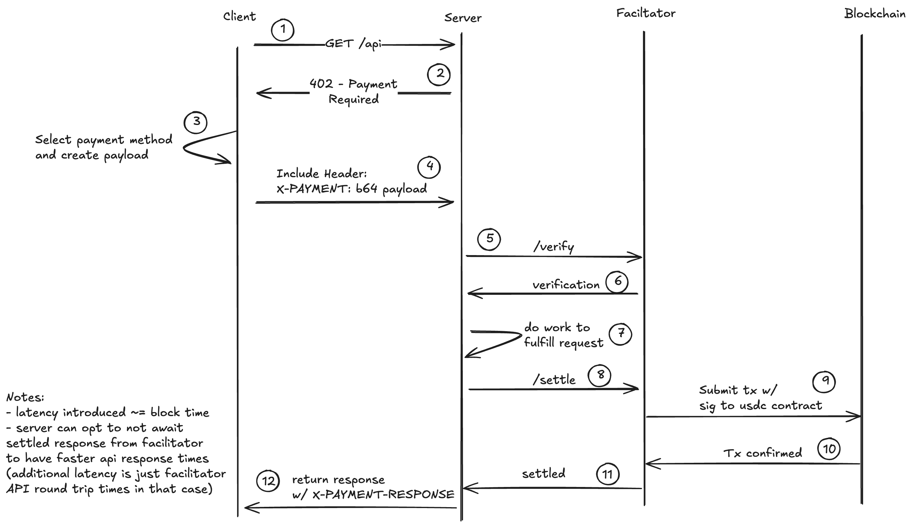

[](https://youtu.be/Qp7n2ZnlbSw)

# Implementing x402 with 1Shot and FastAPI

[x402](https://www.x402.org/) is a payment standard proposed by Coinbase that enables API services to charge for access by piggybacking on top of the
existing [HTTP 402](https://developer.mozilla.org/en-US/docs/Web/HTTP/Reference/Status/402) status code. Specifically, x402 enables API customers,
particularly AI agents, to pay for and gain access to premium API resources by cryptigraphically signing (see [EIP-712](https://eips.ethereum.org/EIPS/eip-712)) time-bound value transfers that are executed onchain by a *fascilitator* (e.g. [1Shot API](https://1shotapi.com)). 

There are 4 primary actors in the x402 scheme:

1. **The Client/Consumer**: This is the entity attempting to read or utilize an API with valuable resources
2. **The Resource Server**: The Resource Server is the actor who is serving paid content in exchange for money
3. **A Facilitator**: This is a logical role which could also be filled by the same entity running the API resource server, but could also the a dedicated 3rd party. The purpose of the facilitator is to [verify X-Payment headers](/src/x402.py#L216) are valid x402 signature payloads and relay these signed payments to the target blockchain network. [1Shot API](https://1shotapi.com) makes it trivial to build your own facilitator or integrate fascilitator functionality into your server.
4. **The Blockchain**: This is the settlement network where the digital asset is deployed that is being accepted as payment, like [USDC](https://basescan.org/token/0x833589fcd6edb6e08f4c7c32d4f71b54bda02913#code) which implements [EIP-3009](https://eips.ethereum.org/EIPS/eip-3009).



## FastAPI and Pydantic

This demo repo focuses on [FastAPI](https://fastapi.tiangolo.com/) as the web server framework and leverages [Pydantic](https://docs.pydantic.dev/latest/) for data validation of the x402 payload specifications. 

Specifically, we show how FastAPI [route dependencies](/src/main.py#L168) can be used to implement x402 payments while being minimally invasive to your existing codebase. 

## Run the x402 Demo

### 1. Log into 1Shot API

Log into 1Shot API, create an [API key and secret](https://app.1shotapi.dev/api-keys), and provision an [Escrow Wallet](https://app.1shotapi.dev/api-keys) on Base Sepolia. Use the [Base Sepolia faucet](https://portal.cdp.coinbase.com/products/faucet) to fund your 1Shot API Base Sepolia wallet so that it can execute transactions on the network. 

Make a copy of the example.env file like this:

```sh
copy example.env docker-compose.env
```

Enter your 1Shot API key and secret into `docker-compose.env` for the `ONESHOT_API_KEY` and `ONESHOT_API_SECRET` variable. Also go to your organization details page and grab your Organization ID; put this in the `ONESHOT_BUSINESS_ID` variable

### 2. Get Your Ngrok Credentials

This example is setup to use [ngrok](https://ngrok.com) so that your API endpoints are accessible to the internet from you local computer. Make a free account, and put your ngrok auth token in `docker-compose.env` in the `NGROK_AUTHTOKEN` variable. 

You should also go to the [`Domains`](https://dashboard.ngrok.com/domains) tab and create a free static url. Put this url (include `https://`) in the `TUNNEL_BASE_URL` variable in `docker-compose.env`. 

### 3. Get Some Base Sepolia USDC

Go to the [Base Sepolia USDC](https://faucet.circle.com/) faucet and send some USDC to your Metamask or Coinbase wallet. 

### 4. Fire Up the Stack

You can start the x402 demo stack with docker like this:

```
docker compose --env-file docker-compose.env up -d
```

You can see requests made to your API endpoints fromt the [ngrok agent dashboard](http://localhost:4040)

### 5. Pay for a Premium API Route

Now you can simulate paying for premium API route access by signing a payload for `$0.05` (your Base Sepolia USDC you got in step 3). 

Go to the premium endpoint of your ngrok tunnel `/premium` and your browser will load an example dApp UI that will allow you to connect your wallet. 

